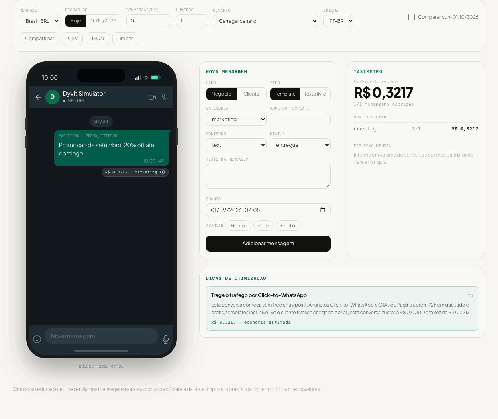

# WhatsApp Messaging Simulator

**Monte a conversa. Veja o custo. Pague menos.**

Ambiente de desenvolvimento *cost-aware* para a WhatsApp Business Platform: voce monta uma
conversa ponta a ponta num frame de telefone e ve, mensagem a mensagem, quanto ela custaria
nas regras da Meta, com o motivo de cada cobranca e dicas de otimizacao.

> Simulacao educacional. Nao enviamos mensagens reais e a cobranca oficial e a da Meta.
> Impostos brasileiros podem incidir sobre os valores mostrados.


<!-- TODO: gravar o GIF do simulador em acao (phone frame + taximetro + toggle 01/10/2026). -->

## Por que

O modelo de precos da Meta virou *per-message* em 01/07/2025, muda de novo em 01/10/2026
(mensagens de service passam a ser cobradas, utility dentro da janela volta a ser cobrado) e
o Brasil ganhou rate card proprio em BRL em 01/07/2026. Nao existe simulador oficial: os
test numbers da Meta nao calculam custo e os BSPs mostram o proprio markup, nao a regra pura.

## O que tem aqui

| Pacote | O que e |
|---|---|
| `@dyvit/whatsapp-pricing` | Motor de preco deterministico: janelas CSW/FEP, tiers, franquia, reason codes |
| `@dyvit/whatsapp-pricing-data` | Rate cards e rulesets versionados por vigencia, como dados abertos |
| `@dyvit/whatsapp-tips` | 10 regras de otimizacao com estimativa de economia |
| `@dyvit/whatsapp-scenarios` | Cenarios prontos (exemplo da spec, FEP, suporte longo, OTP) |
| `@dyvit/whatsapp-simulator-cli` | `dyvit-wa-sim`: precifica um cenario e roda um emulador local da Cloud API |
| `apps/web` | O simulador: phone frame, taximetro, dicas, share por URL, export CSV/JSON |

## Comecando

```bash
pnpm install
pnpm test          # suite completa, incluindo os golden tests de custo
pnpm dev:web       # simulador em http://localhost:3000
```

### CLI

```bash
pnpm cli -- price --scenario worked-example-spec --compare
pnpm cli -- price --file meu-cenario.json --per-month 30000 --csv breakdown.csv
pnpm cli -- scenarios
```

### Emulador local da Cloud API

Troque a base URL do seu projeto para `http://127.0.0.1:4190/v22.0` e mande os mesmos
payloads de sempre. O emulador responde com o mesmo shape da Cloud API, dispara os webhooks
de status assinados e mostra a decisao de preco de cada mensagem.

```bash
pnpm cli -- serve --port 4190 --webhook http://localhost:3000/webhooks/whatsapp --app-secret dev
curl -X POST http://127.0.0.1:4190/v22.0/109876543210/messages \
  -H 'content-type: application/json' \
  -d '{"messaging_product":"whatsapp","to":"+5511999999999","type":"template",
       "template":{"name":"promo","category":"marketing"}}'
curl 'http://127.0.0.1:4190/_sim/state'
```

| Rota | O que faz |
|---|---|
| `POST /v{versao}/{phone-number-id}/messages` | Envio, no shape da Cloud API |
| `POST /_sim/inbound` | Simula uma mensagem do cliente (aceita `entry_point`) |
| `GET /_sim/state` | Timeline precificada ate agora |
| `GET /_sim/webhooks` | Webhooks que foram (ou seriam) entregues |

### Usando so o motor de preco

```ts
import { priceConversation, projectMonthly } from '@dyvit/whatsapp-pricing';

const priced = priceConversation(messages, { asOf: '2026-09-01', market: 'BR', currency: 'BRL' });
console.log(priced.total);                       // 0.3567
console.log(priced.decisions[0].reasonCode);     // 'BILLABLE_MARKETING_TEMPLATE'
console.log(priced.decisions[0].explanation.pt); // por que cobrou
```

Todo preco volta com um trace: ruleset, regra, janela, rate, tier, reason code e a fonte.

## As regras, em uma tela

- Mensagem do usuario nunca cobra e abre/renova a janela de atendimento (CSW) de 24h.
- Cobranca acontece na entrega: `delivered` e `read` cobram, `sent` e `failed` nao.
- Template marketing cobra sempre. Authentication cobra sempre. Utility cobra fora da CSW
  (e, a partir de 01/10/2026, tambem dentro dela).
- Non-template so existe dentro da CSW. Gratis ate 30/09/2026; depois disso cobrado ao rate
  de utility, com franquia de 1.000/mes por numero.
- Free entry point: cliente chegando por anuncio Click-to-WhatsApp ou CTA de Pagina, com
  resposta do negocio em ate 24h, abre 72h em que tudo e gratis. Independe da CSW.
- Tiers de volume valem para utility e authentication, por par mercado–categoria, sobre o
  volume mensal de mensagens cobradas, com reset mensal.

## Precisao dos dados

Rates e limites de volume vem da **fonte primaria da Meta**: o endpoint publico que a
propria calculadora oficial de pricing consome. `scripts/fetch-rate-card.mjs` regenera o
rate card a partir dele, e `--check` falha se o que esta versionado divergir do que a Meta
publica hoje.

```bash
node scripts/fetch-rate-card.mjs --market BR --currency BRL --check
```

Todo numero sem fonte fica marcado no JSON (`ratesVerified`, `tiersVerified`), vira aviso
no CLI e na interface, e `assertReleaseReady()` falha enquanto existir. Hoje o dataset
passa nessa checagem. Ver [CONTRIBUTING.md](./CONTRIBUTING.md).

Uma ressalva que o dado nao cobre: impostos brasileiros podem incidir sobre estes valores,
e o rate card da Meta nao os inclui.

## Desvios da spec de engenharia v2

Tres pontos em que o codigo nao segue a spec ao pe da letra, todos deliberados:

| Spec | Codigo | Por que |
|---|---|---|
| "cobranca so em `delivered` (sent/`read` sem delivered: nao cobra)" | `delivered` e `read` cobram | `SimMessage` carrega um status terminal unico, nao um historico. Mensagem lida foi necessariamente entregue, entao tratar `read` como nao cobrado deixaria toda mensagem lida gratis, que nao e como a Meta cobra. Modelar historico de status (`deliveredAt`/`readAt`) e o caminho certo quando o emulador passar a fazer replay de webhook real. |
| `PriceDecision.chargeBRL: number` | `amount` + `currency` + `amountMicros` | A propria spec suporta USD (seletor de moeda na barra superior, `RateCard.currency: "BRL" \| "USD"`), entao um campo com a moeda no nome se contradiz. `amountMicros` existe porque a soma acontece em inteiros. |
| (sem equivalente) | Tiers e franquia de 1.000 service messages ficam fora do custo por conversa por padrao | Nao e desvio, e a leitura que torna a spec consistente: o `R$ 0,4267` do acceptance criteria #1 so fecha se a franquia nao se aplicar na conversa, e a secao 6.4 diz exatamente isso. Quem quiser a conversa precificada como a N-esima do mes passa `monthlyContext` explicitamente. |

## Nao-objetivos

Nao envia mensagem real, nao e um BSP, nao aprova nem classifica templates (isso e da Meta),
nao replica markup de BSP e nao e ferramenta de billing. WhatsApp Business Calling API e
MM Lite ficam fora por enquanto.

## Licenca

MIT. Veja [LICENSE](./LICENSE).
